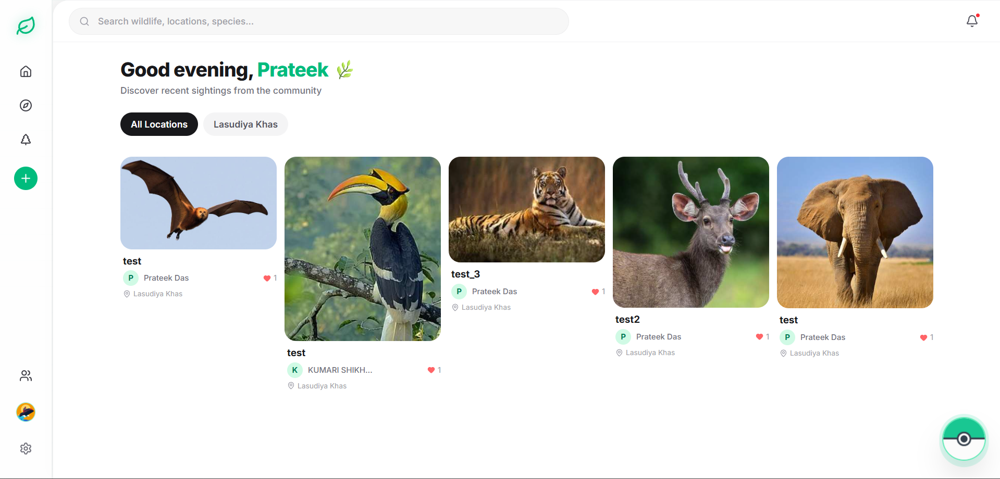
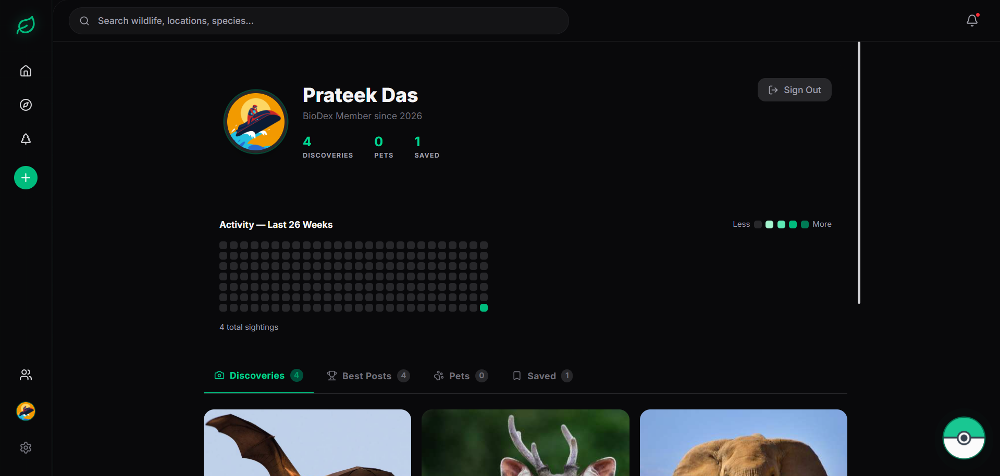

# 🦊 BioDex: Gamified Urban Wildlife Tracker
**Team Debug Duo** *Built for HackMatrix 2026 | Track: Open Innovation (HM44)*

---

> **Live Demo:** [https://biodex-gray.vercel.app/](https://biodex-gray.vercel.app/)

---

> "Think Pokémon GO, but for real urban wildlife. It removes the friction of complex data entry by letting citizens easily snap photos of local animals, automatically mapping them using native browser GPS. It rewards users with discovery badges, instantly creating a rich, crowdsourced dataset that environmental researchers can actually use."

## 🗺️ Product Preview

*Live Community Gallery showcasing real-time sightings.*

*Gamified User Profile with personal discovery badges and stats.*

## 🌍 The Mission
Urban biodiversity data is incredibly scarce because everyday citizens lack a simple, structured, and engaging way to contribute. Without crowdsourced data, monitoring species decline or ecological health is nearly impossible. **BioDex bridges that gap by making data collection fun and effortless.**

## ✨ Key Features
* **🔐 Secure Authentication:** Industry-standard user management and sign-in powered by **Clerk**.
* **📸 One-Tap Sighting Logging:** Seamlessly capture or upload photos of local wildlife.
* **📍 Auto-Geolocation:** Utilizes the HTML5 Geolocation API to instantly extract accurate GPS coordinates.
* **🗺️ Interactive Community Map:** A real-time, Leaflet-powered map displaying all community sightings.
* **🏆 Gamified Progression:** Users earn "Discovery Badges" to incentivize continuous reporting.

# System Architecture – BioDex

# Flowchart – BioDex

## 🛠️ Tech Stack
* **Frontend:** React.js (Vite) + Tailwind CSS
* **Authentication:** **Clerk** (Identity-as-a-Service)
* **Backend:** Node.js + Express.js (Deployed on Railway)
* **Database:** Neon Tech (Serverless PostgreSQL)
* **Media Storage:** Cloudinary
* **APIs:** HTML5 Geolocation API, Leaflet.js, and **Gemini AI Vision**

## 🔄 Working Process
1.  **Identity**: User authenticates via **Clerk** to establish a secure session.
2.  **Capture**: User snaps a photo; app automatically extracts GPS coordinates.
3.  **Analysis**: **Gemini AI** identifies species while photos stream to **Cloudinary**.
4.  **Storage**: Backend validates the **Clerk token** and saves the record to **Neon PostgreSQL**.
5.  **Visualization**: **Leaflet.js** updates the map instantly with new sighting pins.

## 🚀 Future Scope
* **🤖 AI Vision Integration:** Utilizing **Gemini AI** to automatically identify animal species and reduce entry errors.
* **📊 Community Verification:** An upvote system to crowdsource the verification of rare sightings.
* **🏫 Scalability:** Expanding to a nationwide platform with regional leaderboards and school partnerships.
